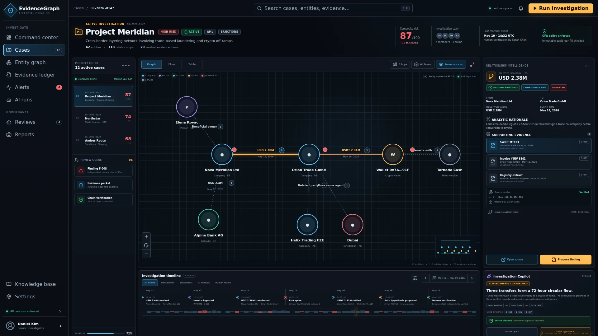
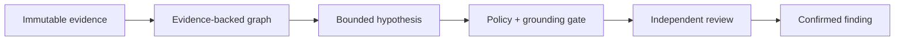
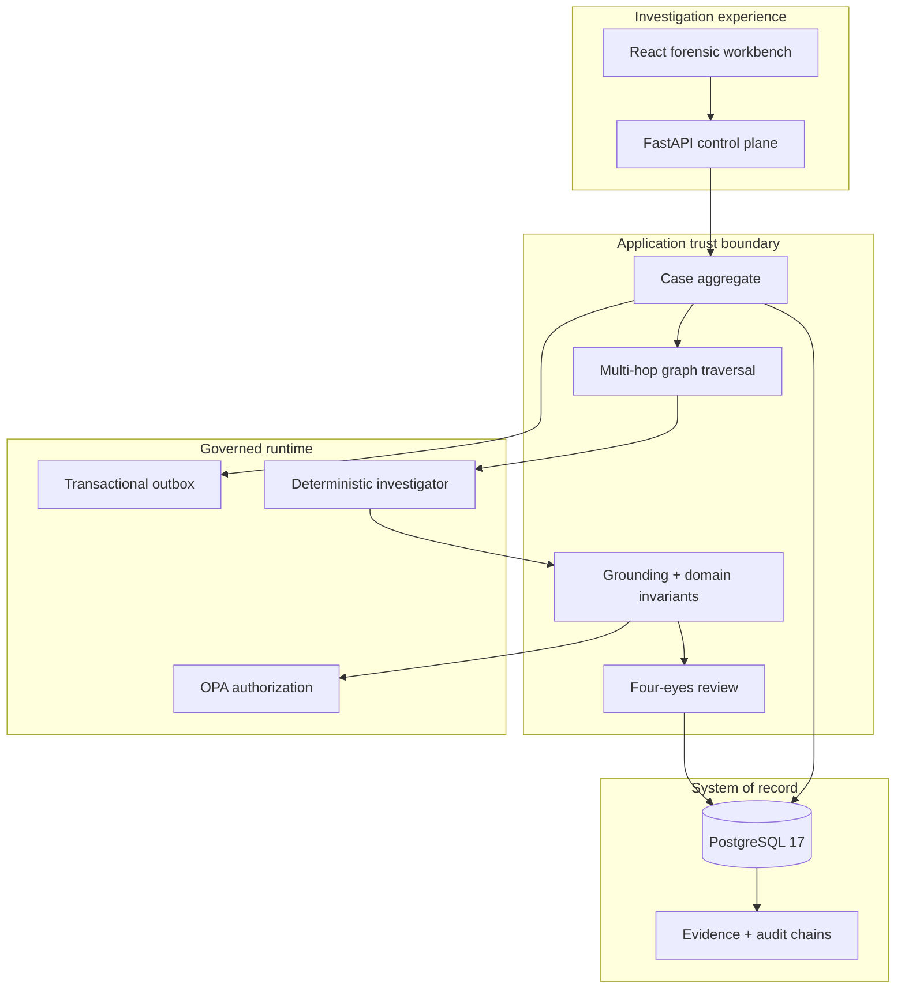
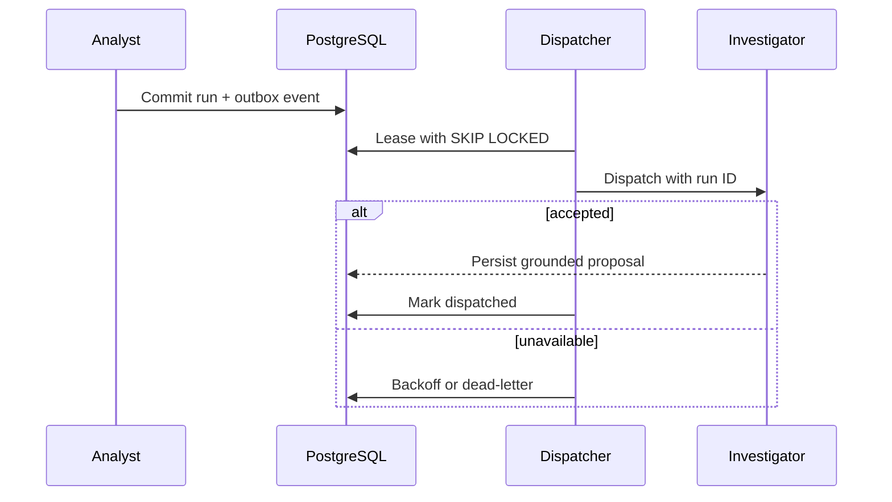

<div align="center">

# EvidenceGraph Financial Crime

### Evidence-first AI investigation for financial crime

A production-shaped reference system for turning fragmented financial records into explainable graph hypotheses — with immutable provenance, deterministic controls, policy enforcement, and independent human review.

[](https://github.com/Runaway1457/evidencegraph-financial-crime/actions/workflows/ci.yml)


[Why it exists](#why-evidencegraph) · [Architecture](#architecture) · [Run it](#run-the-verified-stack) · [Quality evidence](#quality-evidence) · [Documentation](#engineering-record)

</div>



> The screenshot above is generated from the same production bundle that passes CI. The displayed case and every record in this repository are synthetic.

## Why EvidenceGraph

Most AI investigation demos optimize for the answer. Financial-crime systems must optimize for whether the answer can be **proved, reviewed, reproduced, and challenged**.

EvidenceGraph models that difference directly:



The language model is never the system of record. Agent output enters the application as untrusted structured input; it is validated against case-local evidence before it can become a proposed finding. Confirmation remains a human accountability boundary.

### What makes this technically different

| Concern | Naive AI workflow | EvidenceGraph control |
|---|---|---|
| Truth | Model response | PostgreSQL case aggregate + immutable evidence digest |
| Explainability | Free-form rationale | Finding → evidence IDs → graph path → source metadata |
| Hallucinated citations | Prompt instruction | Fail-closed grounding gate rejects unknown or duplicate evidence IDs |
| Authorization | UI role check | OPA decision document, case assignment, explicit obligations |
| Agent retries | Duplicate writes | Idempotent finding signatures + transactional outbox |
| Human oversight | Optional feedback | Four-eyes invariant in the domain and relational schema |
| Auditability | Application logs | SHA-256-linked audit and custody events |
| Async reliability | Database write then message | Run and outbox event committed atomically |
| Graph integrity | Best-effort joins | Composite foreign keys prevent cross-case edges and citations |

## Investigation workbench

The interface is designed as an analyst instrument rather than a chatbot shell:

- risk-prioritized case queue with material-event context;
- interactive multi-hop relationship map with evidence provenance;
- edge-level confidence, rationale, and citation inspection;
- synchronized investigation timeline;
- visibly non-authoritative AI hypothesis panel;
- keyboard command palette with `⌘/Ctrl + K`;
- responsive layouts, visible focus states, and reduced-motion support.

The UI currently uses a deterministic synthetic fixture so reviewers can reproduce the exact visual state without credentials or regulated data. The FastAPI control plane and relational core are tested independently; live workspace/API binding is tracked as a post-reference integration milestone.

## Architecture



The domain and application layers do not depend on FastAPI, SQLAlchemy, OPA, a graph database, or a model provider. Those capabilities sit behind explicit ports. That keeps the evidence model testable and prevents infrastructure choices from becoming business rules.

### Durable investigation dispatch



The implementation includes atomic enqueueing, leasing, bounded retry metadata, idempotency keys, and dead-letter state. A workflow engine can be attached at the dispatcher boundary without coupling it to the financial-crime domain.

## Run the verified stack

Prerequisites: Docker Engine with Compose v2.

```bash
git clone https://github.com/Runaway1457/evidencegraph-financial-crime.git
cd evidencegraph-financial-crime

docker compose -f deployment/compose.yaml up --build
```

Open [http://localhost:8080](http://localhost:8080). The stack waits for PostgreSQL, applies Alembic migrations, starts OPA and the FastAPI service, then serves the optimized frontend through an unprivileged Nginx container.

Verify the runtime:

```bash
curl --fail http://localhost:8080/health/ready

curl --fail   -H 'Content-Type: application/json'   -H 'X-Actor-ID: analyst_1'   -d '{"title":"Project Meridian","description":"Synthetic cross-border investigation"}'   http://localhost:8080/api/v1/cases
```

Expected readiness response:

```json
{"status":"ready","version":"0.2.0"}
```

Run the seeded evidence-backed investigation and complete independent review:

```bash
curl --fail --request POST \
  -H 'X-Actor-ID: analyst_1' \
  http://localhost:8080/api/v1/cases/case_1/investigations \
  | tee investigation.json

FINDING_ID="$(python -c 'import json; print(json.load(open("investigation.json"))[0]["id"])')"

curl --fail --request POST \
  -H 'Content-Type: application/json' \
  -H 'X-Actor-ID: reviewer_2' \
  -d '{"decision":"confirmed"}' \
  "http://localhost:8080/api/v1/cases/case_1/findings/$FINDING_ID/review"
```

Stop and remove demo data:

```bash
docker compose -f deployment/compose.yaml down --volumes
```

### Local quality loop

```bash
python -m pip install -e ".[dev]"
make quality

cd frontend
npm ci
npm run lint
npm run typecheck
npm test
npm run build
```

## Quality evidence

These are release-branch results, produced by GitHub Actions rather than handwritten claims.

| Gate | Verified result |
|---|---:|
| Backend test suite | **34 passed** |
| Backend branch-aware coverage | **90.76%** |
| Frontend test suite | **6 passed** |
| Frontend statements / lines | **97.92% / 97.92%** |
| Frontend branch coverage | **91.22%** |
| Grounding adversarial evals | **10 / 10 passed** |
| Grounding false accepts | **0** |
| OPA policy tests | **4 passed** |
| Schema drift | **None** via `alembic check` |
| Production dependency audit | **No high-severity runtime finding** |
| Container smoke | **Seed + PostgreSQL + migration + OPA + API + web + governed review passed** |

Every push gates linting, formatting, strict typing, unit/integration tests, branch coverage, adversarial grounding evals, policy tests, migration drift, locked frontend installation, dependency audit, production build, verified UI capture, Compose model validation, and full-stack smoke testing.

## Evidence and AI trust model

A proposed finding is accepted only when:

1. its citation set is non-empty;
2. every cited evidence ID exists inside the same case;
3. citations contain no duplicates;
4. confidence is bounded to `[0, 1]`;
5. the policy engine authorizes the action;
6. the entire agent batch validates before any write occurs;
7. a different identity performs final review.

The included deterministic investigator is a reproducible baseline, not a substitute for suspicious-activity rules or a trained detection system. The model-provider boundary is intentionally outside the source-of-truth path.

## Repository map

```text
backend/
  src/evidencegraph/
    domain/           Pure evidence, entity, relationship and finding rules
    application/      Use cases, grounding gate and ports
    infrastructure/   SQLAlchemy, OPA, outbox and deterministic adapters
    api/              FastAPI control plane
  migrations/         Versioned relational schema
  tests/              Domain, API, persistence, security and workflow tests
frontend/
  src/                Typed investigation workspace and interaction tests
policies/             Rego authorization policy and tests
evals/                Versioned adversarial grounding cases
deployment/           Rootless multi-stage images, Compose and Nginx
docs/                 ADRs, threat model, cards, runbook and launch material
```

## Security posture

This repository contains synthetic data only. Containers run as non-root with read-only filesystems and `no-new-privileges`; data and control networks are internal; database schema changes run as a separate job; production policy adapters fail closed; sensitive source material is not sent to traces by design.

This is an engineering reference, not a certified AML product. Before regulated use, an institution must add its own OIDC issuer, secret manager, encrypted object storage, malware scanning, retention policy, jurisdiction-specific controls, validation datasets, model-risk approval, incident response, and legal/compliance sign-off.

See [SECURITY.md](SECURITY.md) and the [threat model](docs/threat-model.md).

## Engineering record

| Document | Purpose |
|---|---|
| [Architecture](docs/architecture.md) | Boundaries, trust model and runtime profiles |
| [ADR-0001](docs/adr/0001-evidence-first.md) | Why evidence — not model output — is authoritative |
| [ADR-0002](docs/adr/0002-transactional-outbox.md) | Why workflow dispatch uses a transactional outbox |
| [Testing strategy](docs/testing-strategy.md) | Test pyramid, adversarial cases and release gates |
| [Threat model](docs/threat-model.md) | Assets, attackers, abuse cases and mitigations |
| [Model card](docs/model-card.md) | Intended use, safeguards and AI limitations |
| [Data card](docs/data-card.md) | Synthetic dataset provenance and restrictions |
| [Operations runbook](docs/runbook.md) | Recovery, degraded modes and incident procedures |
| [Release checklist](docs/release-checklist.md) | Evidence required before publication |
| [Launch kit](docs/launch-kit.md) | Bilingual posts, carousel and demo script |
| [Contributing](CONTRIBUTING.md) | Quality bar and definition of done |

## Design principles

- **Evidence before inference.**
- **Policy before side effects.**
- **Human accountability before confirmation.**
- **Determinism before model sophistication.**
- **Failure visibility before happy-path polish.**
- **Measured claims before marketing claims.**

## License

Apache License 2.0. See [LICENSE](LICENSE).

---

<div align="center">

Built by **Gabriel** as a senior AI engineering portfolio system: applied graph reasoning, governed agents, reliable distributed workflows, security, evaluation, and product design in one reviewable repository.

</div>
