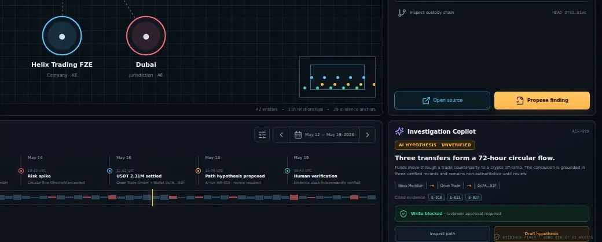
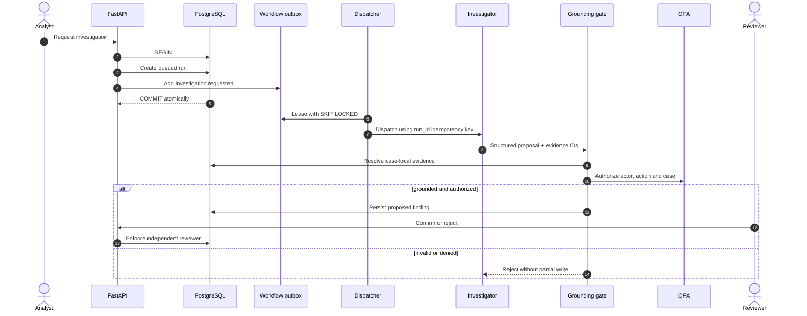

<div align="center">


# EvidenceGraph Financial Crime

### A reviewable AI investigation system for high-risk financial crime analysis

**Graph reasoning · immutable provenance · governed findings · human accountability**

[](https://github.com/Runaway1457/evidencegraph-financial-crime/actions/workflows/ci.yml)


[Product tour](#product-tour) · [Trust model](#trust-model) · [Architecture](#architecture) · [Run locally](#run-the-verified-stack) · [Quality proof](#quality-proof) · [Engineering Hub](https://gabriel-engineering-hub.nagatoimoveis.chatgpt.site)

</div>

---

EvidenceGraph is a production-shaped reference implementation for transforming fragmented financial records into **evidence-backed graph hypotheses**. It separates model reasoning from institutional truth: AI can propose; deterministic controls, policy and an independent reviewer decide what may be recorded.

> [!IMPORTANT]
> The repository uses synthetic data only. It demonstrates software and AI engineering controls; it is not a certified AML decision system and is not intended for real financial data without institution-specific validation, identity, security and compliance controls.

## Why EvidenceGraph

Most AI investigation demos optimize for a fluent answer. A serious financial-crime platform must optimize for a conclusion that can be **proved, reproduced, challenged and independently approved**.

| Question a reviewer asks | EvidenceGraph answer |
|---|---|
| Which source supports this claim? | Every finding references known, case-local evidence IDs. |
| Was the source altered? | Evidence carries a stable SHA-256 digest and custody events. |
| How were two entities connected? | The graph returns the cited relationship path, not only an explanation. |
| Can the model invent a citation? | A fail-closed grounding gate rejects unknown, duplicate or cross-case evidence. |
| Who authorized the action? | OPA evaluates actor, action, case and obligations. |
| Can an investigator approve their own request? | The finding records both human requester and generating agent; the domain and database block the requester from reviewing it. |
| What happens after a retry? | A case-local signature constraint and outbox worker make repeated delivery observable and idempotent. |

## Product tour

<p align="center">
  
</p>

The workbench is designed as a **forensic instrument**, not a chatbot shell. Risk context, graph paths, evidence, material events and unverified AI output remain visible together so an analyst can challenge the reasoning without losing investigative context.

### 1. Multi-hop graph investigation

<p align="center">
  
</p>

The graph emphasizes material flows and cited edges. An analyst can inspect beneficial owners, counterparties, wallets, jurisdictions and services without treating spatial proximity as proof.

### 2. Evidence and provenance inspection

<p align="center">
  
</p>

Each selected relationship exposes its rationale, confidence, source records, digest and custody context. The source remains primary; the model-generated interpretation remains subordinate.

### 3. Governed hypothesis review

<p align="center">
  
</p>

AI output is visibly labeled **unverified**. It becomes a proposed finding only after schema validation, grounding checks and policy authorization, and it becomes confirmed only after independent human review.

## Trust model


The central contract is intentionally stricter than a prompt:

```text
Evidence → cited graph path → bounded hypothesis → policy + grounding → independent review → finding
```

### Grounding invariants

Every proposal is rejected unless all conditions hold:

1. at least one evidence citation is present;
2. every cited ID exists in the same case;
3. duplicate citations are removed or rejected;
4. confidence is bounded to `[0, 1]`;
5. the full proposal batch validates before persistence;
6. the reviewer is not the human who requested the investigation;
7. a resolved finding cannot be reviewed again.

The model is therefore **not** the system of record. Agent output crosses a trust boundary as untrusted structured input.

## Architecture


The codebase follows a ports-and-adapters boundary:

- the **domain layer** owns case state, evidence, graph and review invariants;
- the **application layer** orchestrates investigation, grounding and authorization;
- the **infrastructure layer** implements SQLAlchemy persistence, PostgreSQL, OPA and outbox behavior;
- the **delivery layer** exposes FastAPI and the React investigation workbench.

Infrastructure frameworks do not define business truth. This keeps the evidence model executable in fast tests and makes model providers, graph engines and workflow runtimes replaceable.

### Reliability: transaction before dispatch



The run request and its workflow intent are stored in one database transaction. Leasing, bounded retry and dead-letter state make failure visible instead of silently losing work between PostgreSQL and an external runtime.

## Implementation status

Engineering review depends on distinguishing implemented controls from planned integrations.

| Capability | Current reference implementation | Extension boundary |
|---|---|---|
| Investigator | Deterministic, reproducible circular-flow detector | Model-backed agent implementing `InvestigatorAgent` |
| Graph | Case-local multi-hop traversal with evidence-backed edges | OpenSPG/KAG or another graph backend |
| Policy | OPA/Rego authorization with fail-closed client behavior | Enterprise policy bundle and identity claims |
| Persistence | PostgreSQL 17, SQLAlchemy 2 and explicit Alembic migration | Managed PostgreSQL and encrypted backups |
| Reliability | `202 Accepted` run API, transactional outbox, leased worker, exponential retry, dead-letter state and idempotent findings | Temporal or another external durable workflow runtime |
| Identity | HS256 JWT validation with algorithm, signature, issuer, audience, expiry and subject checks; explicit development-only header mode | Institution-owned OIDC/JWKS and authorization claims |
| Documents | Bounded binary ingestion, atomic local object store, canonical SHA-256, audit event and custody entry in one database transaction | S3, malware scanning, OCR and PII redaction |
| Experience | React workbench bound to live case summaries and asynchronous run status; graph/evidence fixture only in explicit demo mode | Live graph, evidence and review projections |

## Quality proof

These numbers come from the release workflow—not from README decoration.

| Gate | Verified result | What it protects |
|---|---:|---|
| Backend tests | **45 passed** | Domain, API, persistence, identity, audit, policy and reliability behavior |
| Branch-aware coverage | **84.63%** | Untested decision paths across the expanded runtime |
| Grounding evaluations | **10 / 10** | Hallucinated, duplicate and cross-case citations |
| False accepts | **0** | Unsafe proposals entering persistence |
| Frontend tests | **7 passed** | Investigation interactions, live binding and critical states |
| Frontend branch coverage | **85.61%** | UI decision paths |
| OPA policy tests | **4 passed** | Authorization and four-eyes obligations |
| Migration gate | **No drift** | ORM/schema divergence |
| Dependency audits | **0 known vulnerabilities** | Audited Python environment and frontend runtime dependencies |
| Full-stack smoke | **Passed** | PostgreSQL → migration → seed → OPA → API → web → review |

The CI pipeline also runs Ruff, strict MyPy, ESLint, TypeScript type checking, lock-enforced Python and Node builds, Compose validation and a real HTTP investigation/review flow.

[Inspect the latest workflow →](https://github.com/Runaway1457/evidencegraph-financial-crime/actions/workflows/ci.yml)

## Run the verified stack

### Prerequisites

- Docker Engine with Compose v2
- Git
- ports `8080` available locally

```bash
git clone https://github.com/Runaway1457/evidencegraph-financial-crime.git
cd evidencegraph-financial-crime
docker compose -f deployment/compose.yaml up --build web
```

Open [http://localhost:8080](http://localhost:8080). Compose starts PostgreSQL, applies the explicit migration, loads the idempotent synthetic case, starts OPA, the FastAPI service and the hardened Nginx frontend.

```bash
# Readiness
curl --fail http://localhost:8080/health/ready

# Queue a grounded investigation
curl --fail --request POST \
  --header "X-Actor-ID: analyst_1" \
  http://localhost:8080/api/v1/cases/case_1/investigations
```

The response is `202 Accepted` and contains a run ID. Poll it until the worker completes:

```bash
curl --fail http://localhost:8080/api/v1/investigation-runs/RUN_ID
curl --fail http://localhost:8080/api/v1/cases/case_1/findings
```

Use a second actor—not the requesting analyst—to review the resulting finding:

```bash
curl --fail --request POST \
  --header "Content-Type: application/json" \
  --header "X-Actor-ID: reviewer_2" \
  --data '{"decision":"confirmed"}' \
  http://localhost:8080/api/v1/cases/case_1/findings/FINDING_ID/review
```

The same actor cannot propose and confirm the finding.

### Local engineering loop

```bash
make install
make quality
```

`make quality` runs lint, formatting checks, strict typing, backend tests, grounding evaluations and frontend validation using locked dependencies.

## Repository anatomy

```text
evidencegraph-financial-crime/
├── backend/
│   ├── migrations/                 explicit relational history
│   ├── src/evidencegraph/
│   │   ├── domain/                 evidence, graph and review invariants
│   │   ├── application/            use cases, ports and grounding gate
│   │   ├── infrastructure/         PostgreSQL, OPA, outbox and adapters
│   │   └── api/                    FastAPI transport boundary
│   └── tests/                      unit, integration and adversarial tests
├── frontend/                       React 19 forensic workbench
├── policies/                       OPA/Rego decisions and policy tests
├── evals/                          reproducible grounding dataset
├── deployment/                     hardened containers and Compose stack
├── docs/                           ADRs, threat model, cards and runbook
└── .github/workflows/ci.yml        release evidence pipeline
```

## Security posture

Security controls are part of the architecture, not a final checklist:

- canonical lowercase SHA-256 evidence digests and custody chains;
- application- and PostgreSQL-enforced append-only audit/custody rows;
- composite foreign keys preventing cross-case graph and citation links;
- OPA policy decisions scoped by action and case;
- domain-enforced independent review;
- atomic validation of proposal batches;
- signed JWT verification in the secure profile and development auth rejected in production;
- optimistic aggregate versions and case-local unique finding signatures;
- bounded request bodies, edge rate limiting and atomic object writes;
- structured JSON request logs with low-cardinality routes and correlation IDs;
- generic external errors without internal exception leakage;
- non-root containers, read-only filesystems and `no-new-privileges`;
- internal data/control networks with edge-only web exposure;
- explicit migrations separated from API startup.

Read the [threat model](docs/threat-model.md) and [security policy](SECURITY.md) before evaluating deployment suitability.

## Engineering record

| Document | Purpose |
|---|---|
| [Architecture](docs/architecture.md) | Component boundaries and runtime decisions |
| [ADR-0001: Evidence first](docs/adr/0001-evidence-first.md) | Why evidence—not model output—anchors truth |
| [ADR-0002: Transactional outbox](docs/adr/0002-transactional-outbox.md) | Why run intent commits with case state |
| [Threat model](docs/threat-model.md) | Assets, actors, trust boundaries and mitigations |
| [Testing strategy](docs/testing-strategy.md) | Test pyramid, adversarial cases and release gates |
| [Engineering standard](docs/engineering-standard.md) | Evidence contract, authorial voice and claim discipline |
| [Model card](docs/model-card.md) | Investigator behavior and known limitations |
| [Data card](docs/data-card.md) | Synthetic dataset scope and exclusions |
| [Runbook](docs/runbook.md) | Operational diagnosis and recovery |
| [Release checklist](docs/release-checklist.md) | Evidence required before a release claim |
| [Launch kit](docs/launch-kit.md) | Demo narrative and technical talking points |

## Design decisions worth challenging

- **Why PostgreSQL is authoritative:** a high-risk workflow needs relational constraints and auditable transactions before it needs a specialized graph database.
- **Why the deterministic investigator ships first:** it creates a measurable baseline for precision, recall, regression and model value.
- **Why AI cannot persist facts directly:** model fluency is not evidence integrity.
- **Why policy is externalized:** authorization decisions must be inspectable independently of prompts and UI state.
- **Why four-eyes exists in the domain:** a front-end-only approval rule disappears when another client calls the API.

These choices are intentionally documented so reviewers can disagree with them using code and evidence—not architecture theater.

## Roadmap

- [x] Evidence-first domain and relational integrity
- [x] Multi-hop graph traversal with cited relationships
- [x] Deterministic investigation baseline
- [x] OPA policy boundary and independent review
- [x] Transactional outbox, asynchronous run API and recoverable worker
- [x] Bounded binary ingestion with audit and custody persistence
- [x] Optimistic concurrency and database idempotency constraint
- [x] Structured request logging and signed-JWT profile
- [x] Reproducible grounding evaluation suite
- [x] High-density forensic workbench
- [x] Full-stack CI smoke path
- [x] Live case queue and asynchronous run-status integration
- [ ] Model-backed investigator behind the existing port
- [ ] Institution-owned OIDC/JWKS identity adapter
- [ ] Durable workflow adapter and worker runtime
- [ ] OCR, PII controls, malware scanning and S3 adapter

## Contributing

Start with [CONTRIBUTING.md](CONTRIBUTING.md). Changes to trust-sensitive behavior require tests, documentation of the affected invariant and evidence that the quality gates still pass.

## License

Licensed under [Apache 2.0](LICENSE).

<div align="center">

**Gabriel Borges**

AI Engineering · Knowledge Systems · Decision Infrastructure

[Engineering Hub](https://gabriel-engineering-hub.nagatoimoveis.chatgpt.site) · [GitHub](https://github.com/Runaway1457)

</div>
