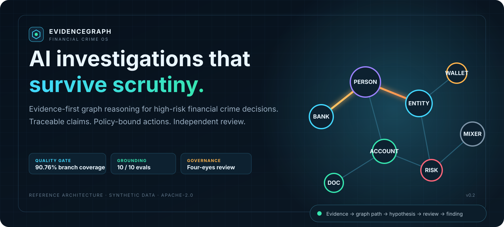
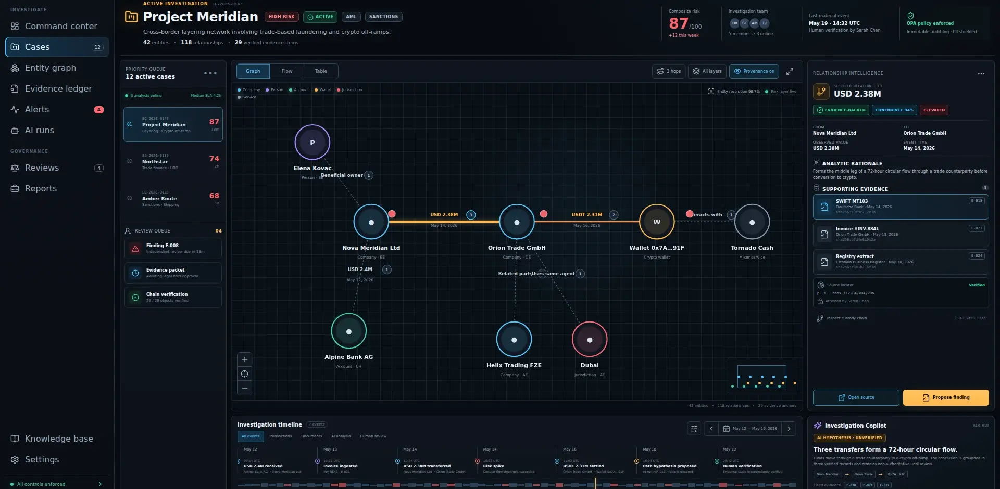
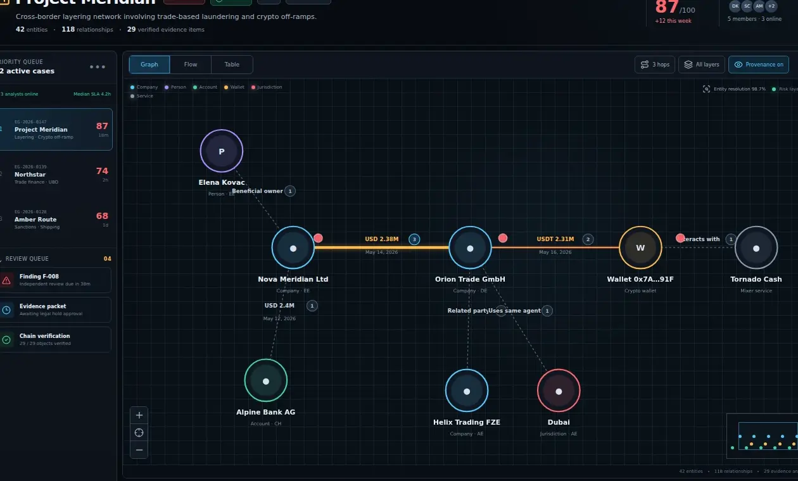
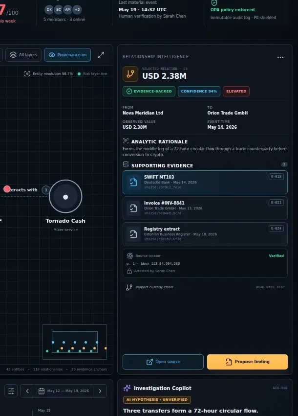
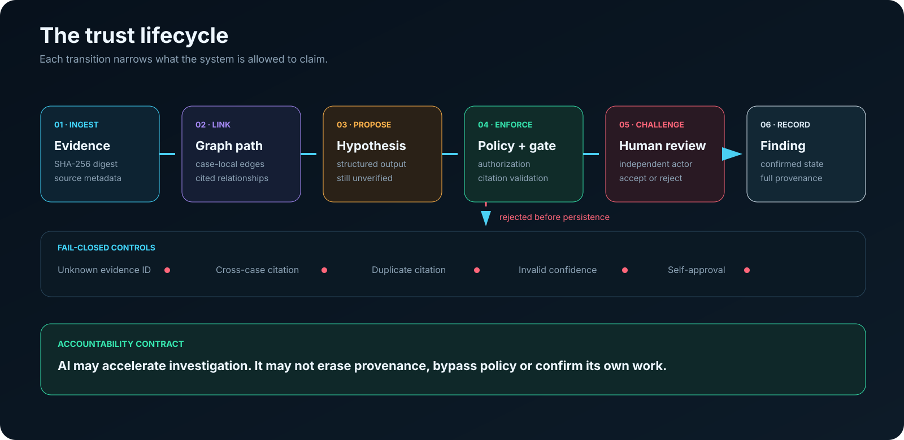
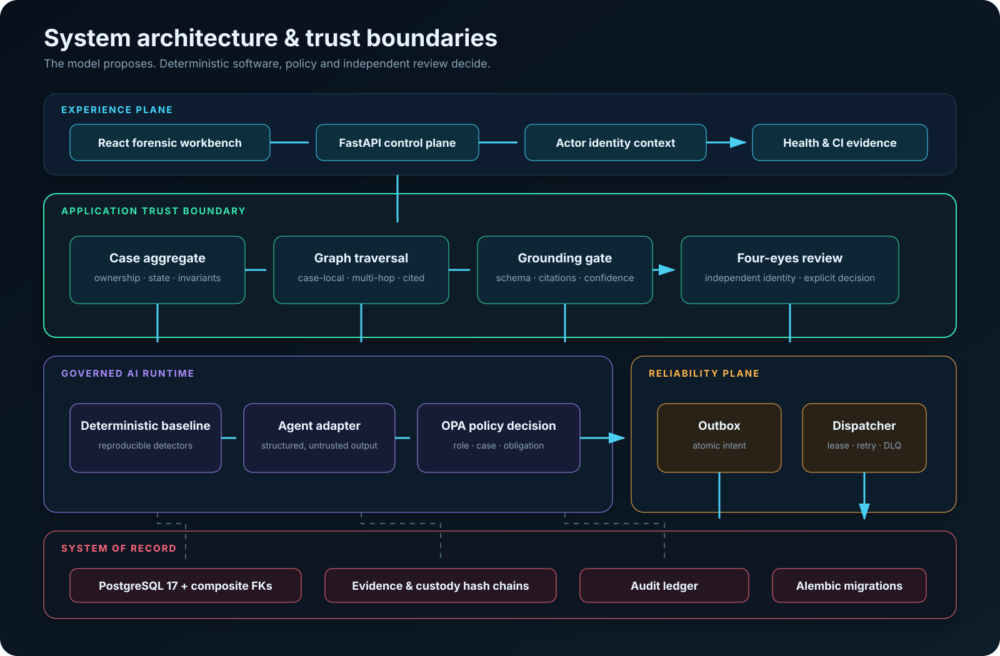

<div align="center">



# EvidenceGraph Financial Crime

### Investigação de crimes financeiros orientada por evidências

**Raciocínio em grafos · proveniência imutável · IA governada · responsabilização humana**

[README internacional](README.md) · [Arquitetura](docs/architecture.md) · [Executar](#executar-o-stack-verificado) · [Qualidade](#evidências-de-qualidade) · [Engineering Hub](https://gabriel-engineering-hub.nagatoimoveis.chatgpt.site)

</div>

EvidenceGraph é uma implementação de referência que transforma registros financeiros fragmentados em **hipóteses fundamentadas por evidências**. A IA pode propor; controles determinísticos, políticas e um revisor independente decidem o que pode ser registrado.

> [!IMPORTANT]
> Todos os dados são sintéticos. O sistema demonstra engenharia de software e IA, mas não é um produto AML certificado para utilização com dados financeiros reais.

## O problema

Em investigação financeira, uma resposta convincente não basta. A conclusão precisa ser reproduzível, contestável e ligada à fonte original.

| Risco | Controle aplicado |
|---|---|
| Citação inventada | Grounding gate rejeita IDs desconhecidos, duplicados ou de outro caso |
| Relação sem prova | Cada aresta material aponta para evidências do mesmo caso |
| Alteração de fonte | SHA-256 e cadeia de custódia |
| Autorização fraca | Política OPA avalia ator, ação, caso e obrigações |
| Autoaprovação | Princípio de quatro olhos aplicado no domínio |
| Duplicação por retry | Assinatura idempotente e transactional outbox |

## Experiência de investigação

<p align="center"></p>

A interface mantém fila de risco, grafo multi-hop, evidências, eventos materiais e a hipótese não verificada no mesmo contexto. Ela foi desenhada como instrumento analítico, não como uma tela genérica de chat.

<p align="center"></p>

<p align="center"></p>

## Modelo de confiança



```text
Evidência → caminho citado → hipótese → política + grounding → revisão independente → finding
```

O modelo de IA nunca é o system of record. Sua saída entra na aplicação como dado estruturado não confiável.

## Arquitetura



- **Domínio:** casos, evidências, grafo, findings e invariantes de revisão.
- **Aplicação:** investigação, grounding, autorização e orquestração.
- **Infraestrutura:** SQLAlchemy, PostgreSQL, OPA e transactional outbox.
- **Entrega:** FastAPI e workspace React.

O repositório separa explicitamente o que já está implementado das integrações planejadas. Atualmente há investigador determinístico, grafo multi-hop, PostgreSQL, OPA, outbox, API, interface e smoke test completo. Model-backed agents, OIDC, OCR e workflow externo permanecem como adapters futuros.

## Evidências de qualidade

| Gate | Resultado |
|---|---:|
| Testes backend | **34 aprovados** |
| Cobertura branch-aware | **90,76%** |
| Evals de grounding | **10/10** |
| False accepts | **0** |
| Testes frontend | **6 aprovados** |
| Testes OPA | **4 aprovados** |
| Drift de migration | **Nenhum** |
| Smoke test ponta a ponta | **Aprovado** |

## Executar o stack verificado

```bash
git clone https://github.com/Runaway1457/evidencegraph-financial-crime.git
cd evidencegraph-financial-crime
docker compose -f deployment/compose.yaml up --build web
```

Abra [http://localhost:8080](http://localhost:8080).

## Documentação técnica

- [Arquitetura](docs/architecture.md)
- [Threat model](docs/threat-model.md)
- [Estratégia de testes](docs/testing-strategy.md)
- [Model card](docs/model-card.md)
- [Data card](docs/data-card.md)
- [Runbook](docs/runbook.md)
- [ADRs](docs/adr/)

<div align="center">

**Gabriel Borges**

AI Engineering · Knowledge Systems · Decision Infrastructure

[Engineering Hub](https://gabriel-engineering-hub.nagatoimoveis.chatgpt.site) · [GitHub](https://github.com/Runaway1457)

</div>
