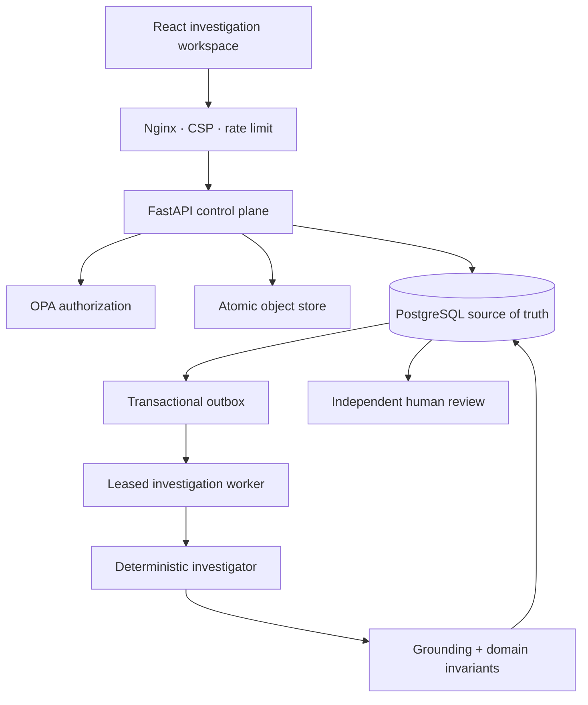
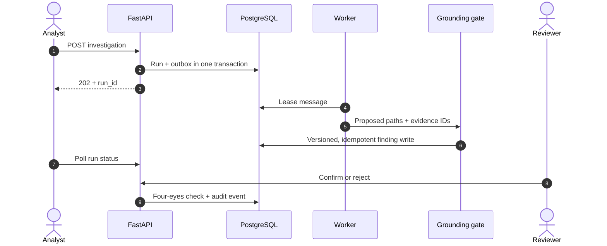

# Architecture

EvidenceGraph is organized around an evidence-first domain. Transport, persistence, policy, workflow and model concerns cross explicit ports instead of entering domain objects.

## Deployed reference path

The React client reads paginated case summaries and asynchronous run status from FastAPI. Its graph and evidence panels use a labeled synthetic fixture until projection endpoints are implemented; fixture mode is enabled explicitly with `VITE_DEMO_MODE=true`.

## Write model

Finding retries are idempotent at two levels: a canonical application signature and a unique `(case_id, signature_sha256)` database constraint. Case writes carry an optimistic version; stale writers fail instead of overwriting a concurrent decision.

## Evidence ingestion

Binary request bodies are bounded using both declared and streamed byte counts. The standalone adapter writes bytes atomically through a temporary file, then commits evidence metadata, a SHA-256 digest, a case audit event and a custody record. A failed database write triggers object compensation.

The local filesystem adapter is a verified standalone boundary, not an S3 claim. Object storage, malware scanning, OCR and PII redaction remain explicit extensions.

## Identity and authorization

- `development`: an optional `X-Actor-ID` is accepted for the local demo only.
- `signed_jwt`: HS256 tokens are checked for algorithm, signature, issuer, audience, expiry, not-before and subject.
- production settings reject development authentication.
- OPA authorizes state-changing actions and fails closed when configured but unavailable.

Institution-owned OIDC/JWKS discovery and role/clearance claims remain future adapters; the repository does not describe the signed-JWT profile as OIDC.

## Trust boundaries

1. Uploaded bytes are untrusted until bounded, hashed, stored and ledgered.
2. Model or baseline output is untrusted structured input.
3. Every relationship and finding citation must resolve inside the same case.
4. The human requester cannot review the resulting finding.
5. A resolved finding cannot be reviewed again.
6. PostgreSQL is authoritative; UI and graph views are projections.
7. Audit and custody rows are append-only in the ORM and through PostgreSQL mutation triggers.

## Extension boundaries

| Port or boundary | Verified adapter | Planned adapter |
|---|---|---|
| Investigator | deterministic two-hop baseline with bounded output | model-backed agent evaluated against the baseline |
| Object storage | atomic local filesystem | S3-compatible immutable bucket |
| Workflow | transactional outbox worker | Temporal |
| Identity | signed JWT | institutional OIDC/JWKS |
| Graph | case aggregate traversal | OpenSPG/KAG projection |
| Document intelligence | binary ledger metadata | malware scan, OCR, PII redaction |
