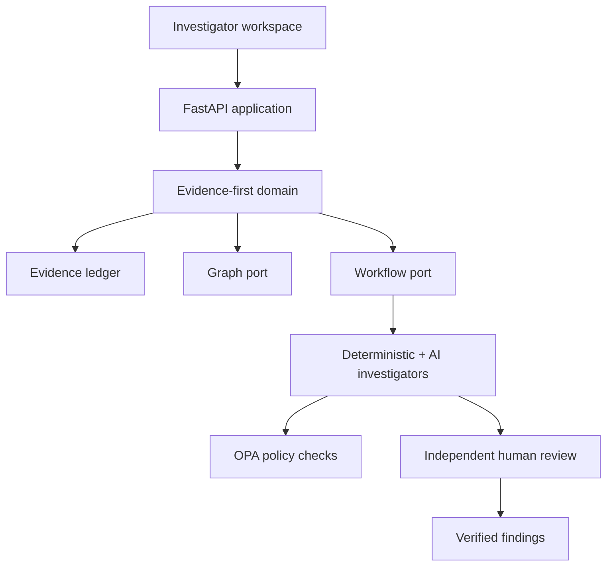

# Architecture

EvidenceGraph uses ports and adapters so the financial-crime domain remains independent from databases, graph engines, workflow runtimes, model providers, and UI frameworks.

## Trust boundaries

1. Uploaded material is untrusted until scanned, hashed, stored, and registered.
2. OCR and extracted text are derived artifacts, never replacements for source evidence.
3. Model output is untrusted structured input.
4. A finding cannot exist without evidence references valid for the same case.
5. A proposer cannot approve their own finding.
6. State-changing agent work is policy checked and auditable.
7. PostgreSQL is the transactional source of truth; graph indexes and search are projections.

## Runtime profiles

- **Standalone:** local development with deterministic analysis and in-process adapters.
- **Enterprise:** PostgreSQL, S3-compatible storage, OIDC, OPA, Temporal, OCR/PII workers, and production telemetry.

The standalone profile demonstrates behavior without pretending optional infrastructure is running. Enterprise adapters fail closed when their required dependencies are unavailable.
